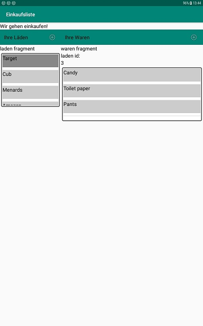
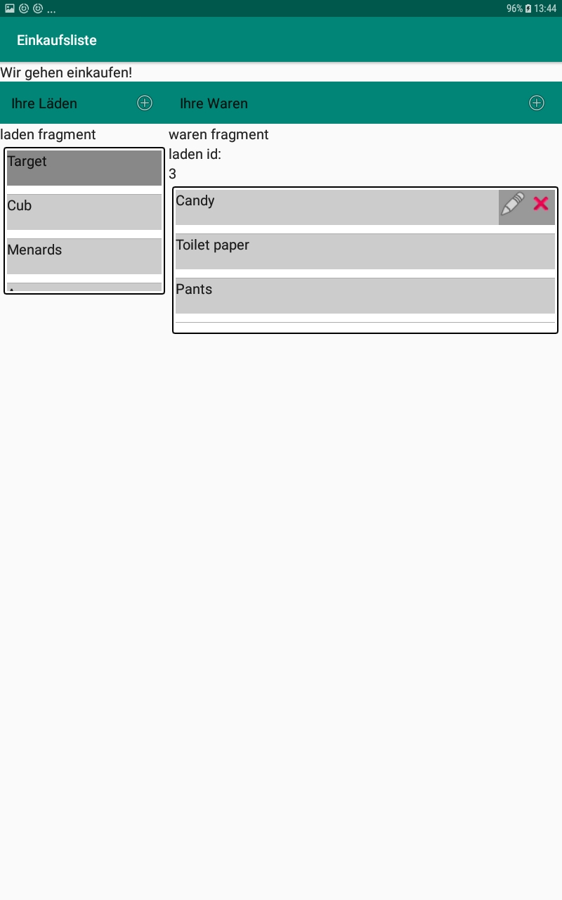
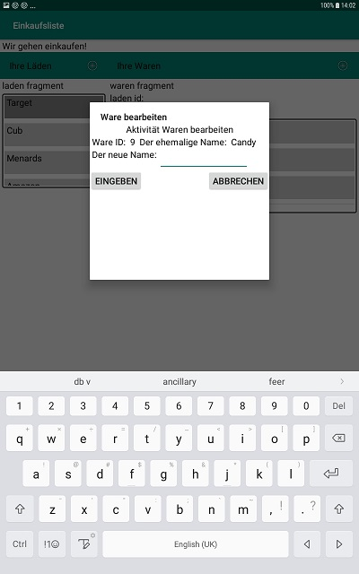

# Einkaufsliste

## Beschreibung
Diese App zeigt Läden in einer Spalte, Waren des jeweiligen Ladens in einer zweiten Spalte.

## Funktion
So sieht die App jetzt aus.

Wenn man einen Laden auswählt, werden dessen Waren angezeigt.

Man kann die RecyclerView mit dem Finger wischen, um Tasten zu enthüllen.

Ein Dialogfenster öffnet sich, wo man die Ware ändern kann.

## Anwendung
Einige Merkmale lassen sich zu anderen Zwecken verwenden.
  * Fragmente für Übersicht und Einzelheiten (master/detail) kommunizieren über ein ViewModel.
  * Die RecyclerView enthält eine zwei-schichtige View, die man zur Seite wischen kann, um Tasten auf dem Hintergrund zu betätigen. 
  * Die üblichen SQLite Datenbankoperationen werden hier auf Kotlin dargestellt. Die Verbindung zur Datenbank wird
    innerhalb von jeder Funktion auf- und zugeschlossen, um Zusammenstöße zu vermeiden.

## Beiträge
Vorerst bitte ich um Ihre Geduld. Die Hochladung des ersten Entwurfs wird einige Wochen dauern. Anregungen zur Verbesserung 
des Codes werden jederzeit begrüsst. Von fortgeschrittenen Features darf man natürlich träumen, und diese füge ich gerne 
zu den [Issues](https://github.com/Galajda/Einkaufsliste/issues?q=is%3Aopen+is%3Aissue+label%3Aenhancement) mit dem Untertitel "enhancements" hinzu.

## Danke für Hilfe
### SQLite Datenbank Verbindung 
[Anupam Chugh](https://www.journaldev.com/9438/android-sqlite-database-example-tutorial)
   
### RecyclerView
[StackOverflow RecyclerView mit SQLite Daten versehen](https://stackoverflow.com/questions/50849457/how-to-populate-recyclerview-from-sqlite-database)
   
[StackOverflow RecyclerView click Empfänger](https://stackoverflow.com/questions/29424944/recyclerview-itemclicklistener-in-kotlin)
    
### Tasten unter RecyclerView
[Mark O'Sullivan](https://github.com/MarkOSullivan94/SwipeRevealLayoutExample) baut eine maßgescheiderte View mit GestureDetector.
   
[FrameLayout wird bevorzugt](https://stackoverflow.com/questions/3929412/layout-layers-z-axis)
   
[Eury Perez Beltre GestureDetector](https://medium.com/@euryperez/android-pearls-detect-swipe-and-touch-over-a-view-203ae2c028dc)
   
### ViewModel
[Android documentation](https://developer.android.com/topic/libraries/architecture/viewmodel)
   
[Shalauddin Ahamad Shuza](https://medium.com/mindorks/how-to-communicate-between-fragments-and-activity-using-viewmodel-ca733233a51c)
   
## Lizenz
[GPLv3](https://github.com/Galajda/Einkaufsliste/blob/master/LICENSE)

